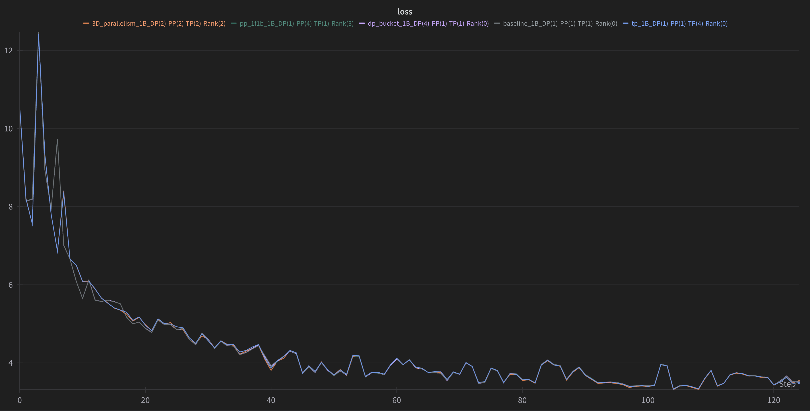

# Picotron tutorial

A step by step tutorial on how to build [Picotron](https://github.com/huggingface/picotron) distributed training framework form scratch 🔥

## Videos

> More to come. Full playlist [here](https://www.youtube.com/playlist?list=PL-_armZiJvAnhcRr6yTJ0__f3Oi-LLi9S) 🎬

- 🎬 [[Picotron tutorial] Part 1: Model, Process Group Manager, Dataloader](https://youtu.be/u2VSwDDpaBM)
- 🎬 [[Picotron tutorial] Part 2: Tensor Parallel](https://www.youtube.com/watch?v=qUMPaSWi5HI&list=PL-_armZiJvAnhcRr6yTJ0__f3Oi-LLi9S&index=3)
- 🎬 [[Picotron tutorial] Bonus: Debugging Distributed codebase](https://www.youtube.com/watch?v=_8xlRgFY_-g&list=PL-_armZiJvAnhcRr6yTJ0__f3Oi-LLi9S&index=4)
- 🎬 [[Picotron tutorial] Part 3: Data Parallel (Naive & Bucket)](https://www.youtube.com/watch?v=k8EpWveM_t4&list=PL-_armZiJvAnhcRr6yTJ0__f3Oi-LLi9S&index=4)

## Setup 

```
conda create -n env-picotron-tutorial python=3.10 --y
conda activate env-picotron-tutorial
pip install -e .
```

## Sanity check

- Convergence testing on a Llama 1B on 4096000 tokens to see if loss match.




```bash
# Basline
cd step3_dataloader/
torchrun --nproc_per_node 1 train.py --micro_batch_size 4 --gradient_accumulation_steps 8 --seq_len 1024 --max_tokens 4096000 --num_proc 16 --model_name TinyLlama/TinyLlama_v1.1 --num_hidden_layers 22 --num_attention_heads 32 --num_key_value_heads 4 --run_name baseline_1B --use_wandb

# Tensor Parallel
cd step4_tensor_parallel/
torchrun --nproc_per_node 4 train.py --tp_size 4 --micro_batch_size 4 --gradient_accumulation_steps 8 --seq_len 1024 --max_tokens 4096000 --num_proc 16 --model_name TinyLlama/TinyLlama_v1.1 --num_hidden_layers 22 --num_attention_heads 32 --num_key_value_heads 4 --run_name tp_1B --use_wandb

# Data Parallel
cd step6_data_parallel_bucket/
torchrun --nproc_per_node 4 train.py --dp_size 4 --micro_batch_size 1 --gradient_accumulation_steps 8 --seq_len 1024 --max_tokens 4096000 --num_proc 16 --model_name TinyLlama/TinyLlama_v1.1 --num_hidden_layers 22 --num_attention_heads 32 --num_key_value_heads 4 --run_name dp_bucket_1B --use_wandb

# Pipeline Parallel
cd step8_pipeline_parallel_1f1b/
torchrun --nproc_per_node 4 train.py --pp_size 4 --pp_engine 1f1b --micro_batch_size 4 --gradient_accumulation_steps 8 --seq_len 1024 --max_tokens 4096000 --num_proc 16 --model_name TinyLlama/TinyLlama_v1.1 --num_hidden_layers 22 --num_attention_heads 32 --num_key_value_heads 4 --run_name pp_1f1b_1B --use_wandb

# 3D parallelism (Tensor + Data + Pipeline parallel)
torchrun --nproc_per_node 8 train.py --tp_size 2 --pp_size 2 --pp_engine 1f1b --dp_size 2 --micro_batch_size 2 --gradient_accumulation_steps 8 --seq_len 1024 --max_tokens 4096000 --num_proc 16 --model_name TinyLlama/TinyLlama_v1.1 --num_hidden_layers 22 --num_attention_heads 32 --num_key_value_heads 4 --run_name 3D_parallelism_1B --use_wandb
```
